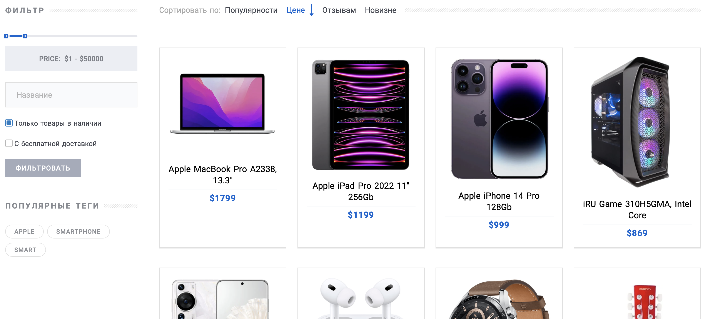
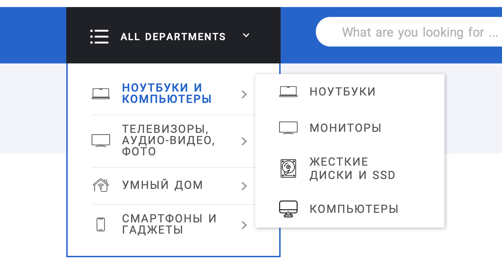
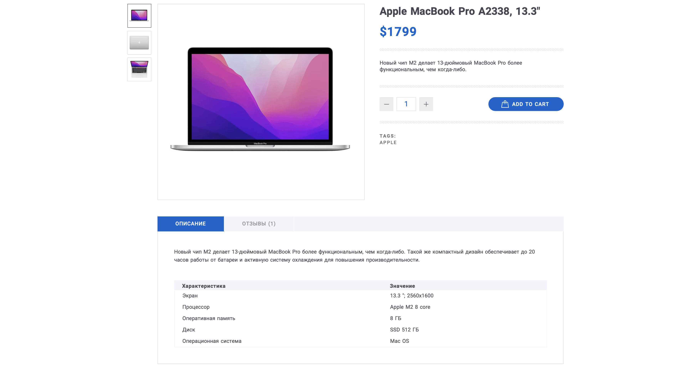
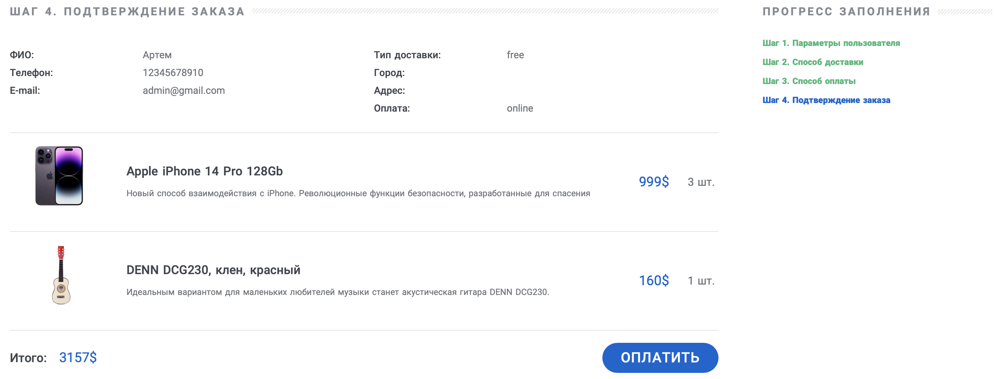
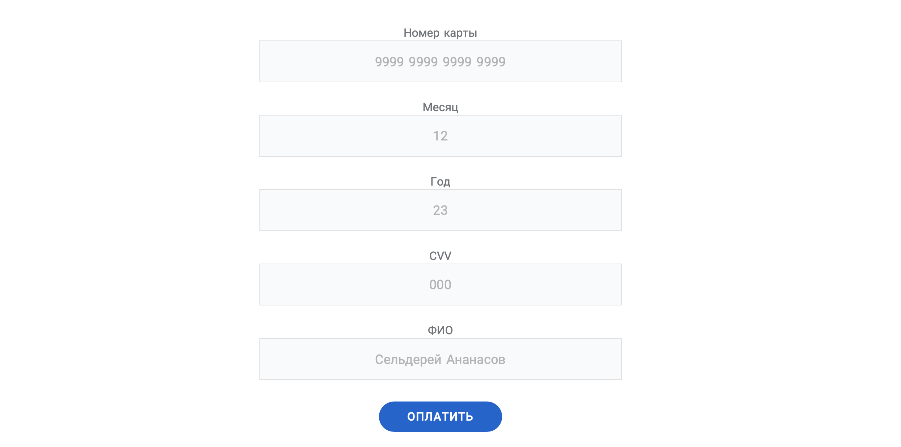
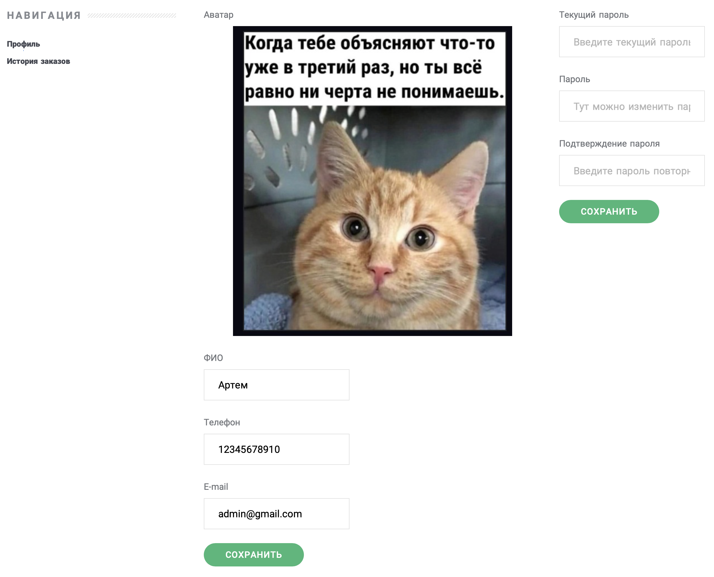

# Интернет-магазин
## Содержание
* [Описание](#description)
* [Установка и настройка](#install)
  * [Перед тем, как начать](#install-python)
  * [Клонирование репозитория](#install-git)
  * [Файл .env](#install-env)
  * [Установка библиотек](#install-utils)
  * [Миграции БД](#install-migrations)
  * [Наполнение БД](#install-fixtures)
  * [Запуск](#install-start)
* [Структура сайта](#structure)
* [Роли пользователей](#roles)
* [Состав страниц сайта](#pages)
  * [Главная страница](#main)
  * [Каталог](#catalogs)
    * [Каталог товаров](#catalogs-catalog)
    * [Товары по акции](#catalogs-sales)
    * [Категории](#catalogs-categories)
    * [Страница товара](#catalogs-product)
  * [Заказ](#order)
    * [Корзина](#order-basket)
    * [Оформление заказа](#order-create)
    * [Оплата заказа](#order-pay)
  * [Пользователь](#user)
    * [Личный кабинет](#user-profile)
    * [Регистрация и авторизация](#user-auth)
  * [Административный раздел](#adminpanel)
* [Используемые библиотеки](#utils)

<a name="description"></a>
## Описание
Интернет-магазин позволяет просматривать каталог товаров, фильтровать/сортировать товары, добавлять товары в корзину, авторизовываться, редактировать профиль, формировать заказ и оплачивать его.\
Администрирование происходит через админ-панель Django.\
Создание, редактирование и удаление пользователей, профилей, категорий, товаров, изображений к товарам, отзывов, спецификаций, тегов, заказов.

Реализовано на фреймворке Django REST framework.

<a name="install"></a>
## Установка и настройка
<a name="install-python"></a>
### Перед тем, как начать
* Проверьте, что у вас установлен `Python` и есть виртуальное пространство

<a name="install-git"></a>
### Клонирование репозитория
* Перейдите в папку проекта и выполните команду в консоли `git clone`, чтобы скопировать файлы репозитория
```
git clone https://github.com/PanicNyan/Django_online_store
```

<a name="install-env"></a>
### Файл .env
* Скопируйте файл `.env.template` или его содержимое и сохраните под именем нового файла `.env`
* Укажите данные в файле `.env`
  * Секретный ключ проекта в переменную **DJANGO_SECRET_KEY**
  * Режим Debug в проекте (значение «1» обозначает True, при значении «0» будет False) в переменную **DJANGO_DEBUG**
  * Дополнительные IP-адреса через запятую без пробелов в переменную **DJANGO_ALLOWED_HOSTS** (при необходимости)
```
DJANGO_SECRET_KEY=Секретный ключ
DJANGO_DEBUG=1
DJANGO_ALLOWED_HOSTS=1.1.1.1,2.2.2.2
```

<a name="install-utils"></a>
### Установка библиотек
* Перейдите в папке проекта к файлу `requirements.txt` и введите команду в консоль для установки всех библиотек
```
pip install -r requirements.txt
```

<a name="install-migrations"></a>
### Миграции БД
* В папке проекта перейдите к файлу `manage.py` и введите команду в консоль для миграций БД 
```
python manage.py migrate
```

<a name="install-fixtures"></a>
### Наполнение БД
* При необходимости, если нужно загрузить тестовые товары, категории, пользователей и т.д., загрузите фикстуры в проект.\
Перейдите к файлу `fixtures.json` и введите команду `loaddata`.\
Из пользователей будет добавлен администратор «admin» и 2 пользователя «leonid» и «petya». Пароль каждого по умолчанию «123456»
```
python manage.py loaddata fixtures.json
```
* Либо добавьте аккаунт администратора командой в консоли и следуйте инструкции
```
python manage.py createsuperuser
```

<a name="install-start"></a>
### Запуск
* Запустите проект командой
```
python manage.py runserver
```
* Откройте в браузере страницу интернет-магазина по адресу `http://127.0.0.1:8000/`

<a name="structure"></a>
## Структура сайта
* Главная страница.
* Каталог с фильтром и сортировкой:
  * Сам каталог товаров.
  * Детальная страница товара, с отзывами.
* Оформление заказа:
  * Корзина.
  * Оформление заказа.
  * Оплата.
* Личный кабинет:
  * Личный кабинет.
  * Профиль.
  * История заказов.
* Административный раздел:
  * Просмотр и редактирование товаров.
  * Просмотр и редактирование заказов.
  * Просмотр и редактирование категорий каталога.

<a name="roles"></a>
## Роли пользователей
Роли пользователей:
* **Администратор** — полный доступ к админке.
* **Покупатель** — любой авторизованный пользователь, может
пользоваться всеми публичными возможностями системы.
* **Незарегистрированный пользователь** — может просматривать каталоги
и собирать корзину.

<a name="pages"></a>
## Состав страниц сайта
Шапка сайта состоит из ссылок на соцсети, ссылок на регистрацию и авторизацию, логотипа — названия сайта, корзины и навигация по сайту.\
Если пользователь авторизован, то ссылки на авторизацию и регистрацию заменяются на ссылку на личный кабинет.\
Футер сайта состоит из названия сайта, навигационного меню по статичным страницам и другой статичной информации.

<a name="main"></a>
### Главная страница
На главной странице отображаются три избранные категории товаров:
* Популярные товары (по средней оценке отзывов)
* Товары по акции
* Ограниченный тираж (по кол-ву)


<a name="catalogs"></a>
### Каталог
<a name="catalogs-catalog"></a>
#### Каталог товаров
Каталог товаров с возможностью фильтрации, сортировки и постраничной навигацией.
* Сортировка по возрастанию или убыванию
  * По популярности (количеству покупок товара)
  * По цене
  * По отзывам (их количеству)
  * По новизне
* Фильтр для вывода товаров в каталоге
  * По названию (регистронезависимый поиск)
  * По цене
  * По тегам
  * С установкой «В наличии»
  * С установкой «Бесплатная доставка»



<a name="catalogs-sales"></a>
#### Товары по акции
Карточки товаров с отображением информации о товаре по акции:
* Период действия акционной цены от и до
* Обычная цена
* Цена по акции


<a name="catalogs-category"></a>
#### Категории
Выпадающий список с категориями и подкатегориями товаров. 
При переходе по ним выводится каталог товаров из этой категории или подкатегории.



<a name="catalogs-product"></a>
#### Страница товара
Отображение информации о товаре с отзывами.\
Функционал:
* Выбор кол-ва и добавление в корзину
* Отображение тегов
* Вывод описания и спецификаций
* Отзывы к товару с возможностью добавить авторизованному пользователю



<a name="order"></a>
### Заказ
<a name="order-basket"></a>
#### Корзина
Отображение товаров, которые добавил пользователь, с управлением количества товара с возможностью удаления.


<a name="order-create"></a>
#### Оформление заказа
При оформлении товара на странице происходит последовательное пошаговое оформление:
* Указываются параметры пользователя
  * ФИО
  * Email
  * Телефон пользователя
* Выбирается способ доставки
  * Выбор «Доставка» или «Экспресс-доставка»
  * Город
  * Адрес
* Выбирается способ оплаты
* Отображается блок подтверждения заказа
  * Вывод всей информации о заказе
  * Вывод всех товаров в заказе



<a name="order-pay"></a>
#### Оплата заказа
Выводится страница с вводом данных для оплаты, после подтверждения оплаты, меняется статус заказа.



<a name="user"></a>
### Пользователь
<a name="user-profile"></a>
#### Личный кабинет
В этот раздел доступ имеет только авторизированный пользователь.\
В профиле пользователя выводятся поля для изменений:
* Аватар
* ФИО
* Email
* Телефон
* Пароль аккаунта

И ссылка на историю заказов, которая отображается в порядке убывания даты оформления заказа с общей информацией о заказе.



<a name="user-auth"></a>
#### Регистрация и авторизация
Страница с входом по логину и паролю либо регистрация с вводом имени, логина и пароля.

<a name="adminpanel"></a>
### Административный раздел
Используется стандартная админ-панель Django и доступна только администратору, который может полностью управлять данными об элементе:
* Просматривать список
* Редактировать элемент
* Добавлять новый
* Удалять существующие

Разделы позволяют управлять:
* Пользователями и профилями
* Товарами и товарами к ним
* Изображениями к товарам
* Спецификациями к товарам
* Категориями товаров
* Тегами
* Заказами
* Доставками
* Отзывами


<a name="utils"></a>
## Используемые библиотеки
asgiref==3.7.2\
diploma-frontend\
Django==4.2.4\
django-filter==23.2\
django-request-logging==0.7.5\
djangorestframework==3.14.0\
Pillow==10.0.0\
python-dotenv==1.0.0\
pytz==2023.3\
sqlparse==0.4.4\
